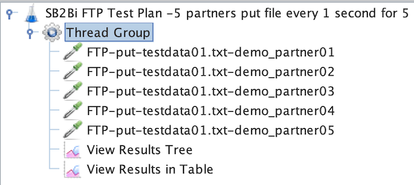

# Setting up JMeter to do load testing on IBM Sterling B2B and Connect:Direct


Do not use GUI mode for load testing!, only for test creation and test debugging.

For load testing, use CLI mode (not GUI):

```bash
jmeter -n -t [jmx file] -l [results file] -e -o [Path to web report folder]
```

increase the Java Heap to meet your testing requirements Best Practices with JMeter

## Creating Partners in Sterling File Gateway
Create some partners, for example:

* demo_partner01
* demo_partner02
* demo_partner03
* demo_partner04
* demo_partner05

Follow the steps below to create partners: IBM Sterling File Gateway: Creating a Partner

## Creating the Load Test using the FTP Protocol

1) Create a new test plan "Test Plan"

* Name: SB2Bi FTP Test Plan

2) Select the 'Test Plan' node and right click on it.

3) Hover over Add -> Topic (Users) -> Thread Group "Thread Group"

* Number of Threads (Users) = 5
* Ramp-up Period (seconds) = 1
* LoopCount = 5

4) Add a Sample > FTP and specify connection settings:

* Server Name
* Port Number
* Username
* Password (unencrypted)
* FTP command to be executed (such as get or put)
* Remote File
* Local File

5) Optional: Create other Samples by changing FTP

6) Add to Listener > View Results Tree

7) Add to Listener > View Results in Table

8) Run the test




## Creating the Load Test using the SFTP Protocol

### Prerequisites

1) Download the Plugins Manager JAR file ( https://jmeter-plugins.org/get/ ) and place it in JMeter's **lib/ext** directory.

2) Then start JMeter and go to the **Options** menu to access the Plugin Manager .

3) Under available plugins, search for **SSH** , install the plugin.


### Creating the Test Plan
1) Create a new test plan "Test Plan"

Name: SB2Bi SFTP Test Plan

2) Select the 'Test Plan' node and right click on it.

3) Hover over Add -> Topic (Users) -> Thread Group "Thread Group"

4) Add a Sample > SSH SFTP and specify connection settings:

* Hostname
* Port
* User Name
* Password
* Action
* Source path
* Target path

5) Optional: Create other Samples using SFTP

6) Add to Listener > View Results Tree

7) Add to Listener > View Results in Table

8) Run the test


