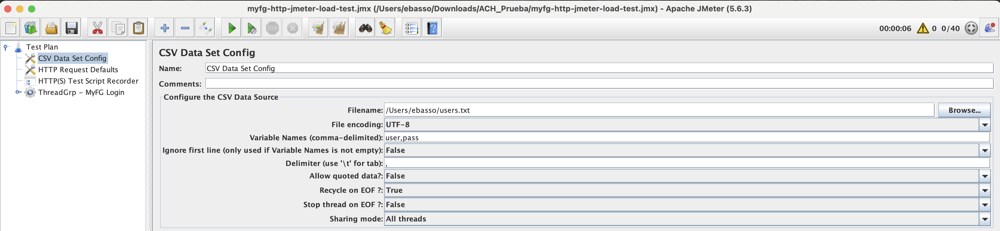
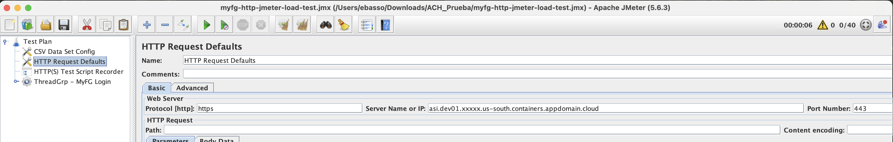

# Run FTP Load Test on Sterling B2B Integrator


## Creating Partners in Sterling File Gateway

Create some partners, on IBM Sterling File Gateway. For example:

* demo_partner01
* demo_partner02
* demo_partner03
* demo_partner04
* demo_partner05

with password:

* passw0rd

Create a file 'users.txt' and populate with user and password (base64 encode):

```
demo_partner01,cGFzc3cwcmQ=
demo_partner02,cGFzc3cwcmQ=
demo_partner03,cGFzc3cwcmQ=
demo_partner04,cGFzc3cwcmQ=
demo_partner05,cGFzc3cwcmQ=
demo_partner01,cGFzc3cwcmQ=
demo_partner02,cGFzc3cwcmQ=
demo_partner03,cGFzc3cwcmQ=
demo_partner04,cGFzc3cwcmQ=
demo_partner05,cGFzc3cwcmQ=
```


## Creating the Load Test using the FTP Protocol

1) Download and open sb2bi-myfg20-load-tests/myfg-http-jmeter-load-test.jmx for this repository

2) Define CSV Data set



3) Change default url on HTTP Default Request




4) Hover over Add -> Topic (Users) -> Thread Group "Thread Group"

* Number of Threads (Users) = 5
* Ramp-up Period (seconds) = 1
* LoopCount = 1

5) Run the test


